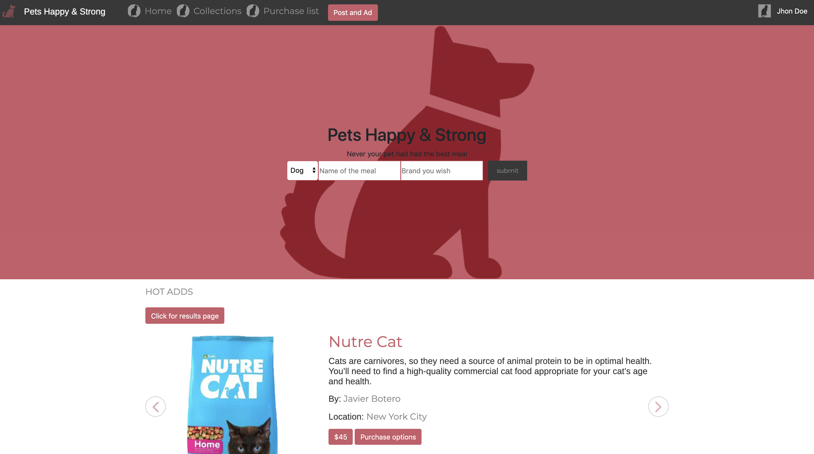

# Pet Shooping Web Page

> This is a Pet shopping website. The design is based on the Mohammed Awad design that you can find in the webpage Behance in this link [Design Mohammed Awad](https://www.behance.net/gallery/24796463/ZATTIX). The main idea is to use CSS properties and features like Flexbox, Grid, and others to reach the same look like the reference design page above in the link. Also, I used the framework bootstrap and the preprocessor Sass in order to make faster the workflow.

## Built With

- HTML,
- CSS,
- Bootstrap
- SASS

## Live Demo

[Live Demo Link](https://raw.githack.com/javierbotero/PetsFood/newDesign/index.html)

## Video explanation of the project

[Video of the project](https://www.loom.com/share/9f1e5e2e619b4dd998a114239e44d172)

To get a local copy up and running follow these simple example steps.

### You need a  code editor like Atom or Visual Studio Code.

### Setup: Just fork the project and you will have a copy of the repo or

### download the files and start making nice changes!.

## Authors

👤 **Javier Botero**

- Github: [@githubhandle](https://github.com/javierbotero)
- Twitter: [@twitterhandle](https://twitter.com/JavierBotero1)
- Linkedin: [linkedin](https://www.linkedin.com/in/javier-botero-044686155/)

## 🤝 Contributing

Contributions, issues and feature requests are welcome!

Feel free to check the [issues page](issues/).

## Show your support

Give a ⭐️ if you like this project!

